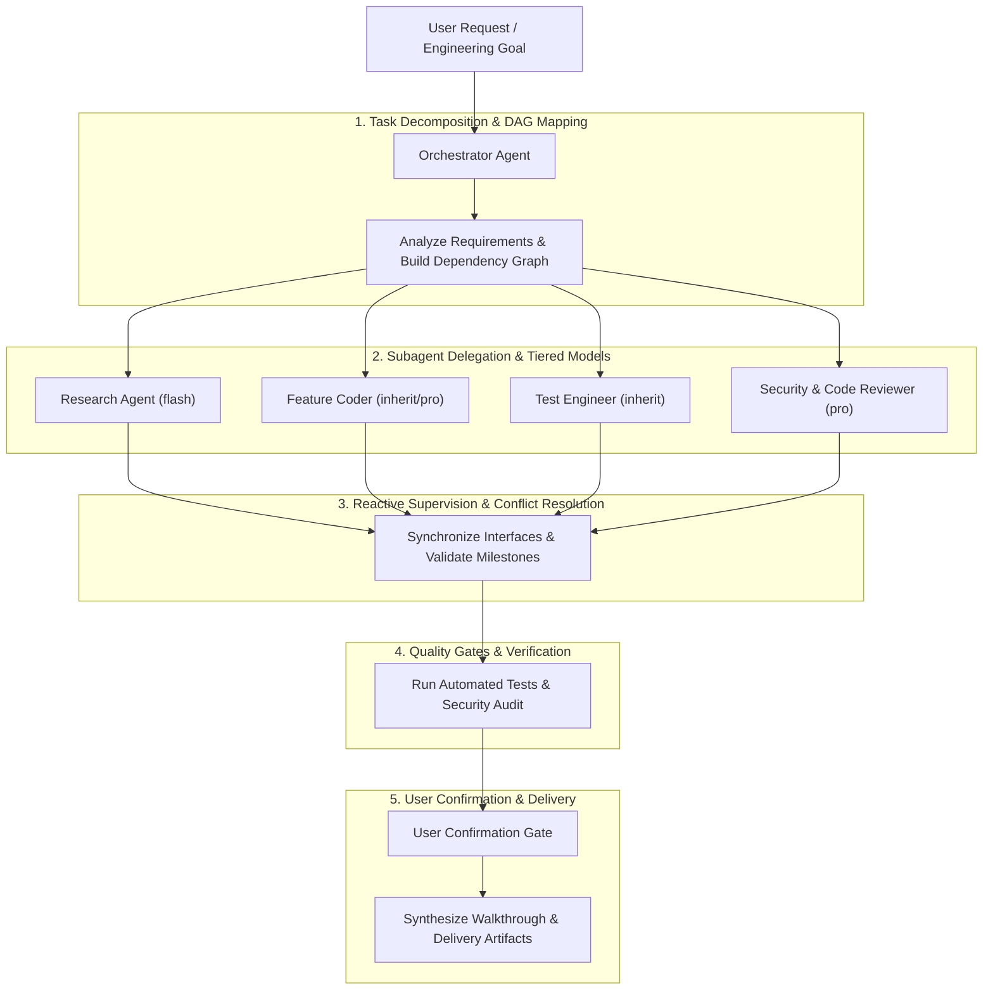

# Multi-Agent Orchestrator

## Overview

The **Orchestrator** is a meta-agent responsible for breaking down complex software engineering challenges, architecting clean execution plans, delegating focused tasks to specialized subagents, and supervising the end-to-end delivery pipeline. 

Instead of letting a single agent context accumulate massive token load and suffer degradation, the Orchestrator maintains an overarching view, assigns strict **bounded contexts** to worker agents, resolves inter-agent discrepancies, and enforces rigorous quality standards.



---

## When to Use

- Tasks touching multiple modules, services, or repository layers (e.g. Database + Backend API + Frontend UI + CI/CD).
- Projects requiring extensive codebase research, spike exploration, or deep library documentation queries before coding.
- Complex refactoring, migration, or performance optimization where isolated testing and adversarial review are necessary.
- Workflows that can benefit from parallel execution tracks (e.g. concurrent research of different libraries, or writing unit tests while implementing mock services).

**When NOT to use:**
- Single-file edits, simple bug fixes, or minor script adjustments (execute directly without subagent overhead).
- Direct conversational Q&A or purely informational inquiries.

---

## The 5-Phase Orchestration Pipeline

### Phase 1: Task Decomposition & Dependency Graph (DAG)

1. **Clarify Constraints & Success Criteria**:
   - Identify inputs, explicit outputs, edge cases, and non-functional requirements (performance, backward compatibility, security).
2. **Construct the Execution DAG**:
   - Break the objective into vertical slices or modular blocks.
   - Categorize subtasks into **Independent (Parallel)** vs. **Dependent (Sequential)** tracks.

```
Example Execution DAG:
[Research Existing Architecture] (Parallel Track A)
            │
            ▼
[Define Interface Contract / API Spec]
            │
    ┌───────┴───────────────────┐
    ▼                           ▼
[Backend Implementation]   [Frontend Mock / UI Skeleton] (Parallel Track B)
    │                           │
    └───────┬───────────────────┘
            ▼
[Integration & Automated Testing]
            │
            ▼
[Adversarial Review & Security Audit]
```

---

### Phase 2: Persona Selection & Subagent Invocation

Match subtasks to the most effective subagent persona, model tier, and workspace isolation mode:

| Role | Default Type | Model Tier | Workspace Mode | Primary Responsibility |
| :--- | :--- | :--- | :--- | :--- |
| **Codebase Researcher** | `research` | `flash` | `inherit` | Search symbols, read docs, find call sites without polluting main context. |
| **Architect / Spec Writer** | `self` | `pro` / `inherit` | `inherit` | Draft technical interfaces, schemas, and API contracts. |
| **Vertical-Slice Coder** | `self` (or custom) | `inherit` / `pro` | `branch` or `inherit` | Implement concrete features adhering strictly to the contract. |
| **Test Engineer** | `test-engineer` | `inherit` | `inherit` | Write unit, integration, and property-based test suites; verify edge cases. |
| **Code & Security Reviewer** | `code-reviewer` / `security-auditor` | `pro` | `inherit` | Adversarial multi-axis review (correctness, performance, security, architecture). |

#### Model Tier Strategy
- **`flash`**: Use for high-volume read operations, broad grep analysis, external documentation lookup, or summarizing large files.
- **`inherit` / `pro`**: Use for deep reasoning, writing complex business logic, architectural designs, and vulnerability detection.

#### Workspace Isolation Strategy
- **`inherit`**: Default mode. Subagents share the current working tree.
- **`branch`**: Creates an isolated branch workspace for speculative spikes, risky refactors, or high-conflict multi-developer simulation.
- **`share`**: Shares underlying repo storage with independent branch pointers.

---

### Phase 3: Reactive Supervision & Communication Protocols

1. **No-Polling Protocol**:
   - Never run tight status-checking loops or artificial sleep commands.
   - Dispatch subagents with clear instructions and wait for automatic reactive wakeups from the messaging system.
2. **Interface Contract Enforcement**:
   - When parallel subagents work on consumer/producer components, the Orchestrator supplies the agreed interface schema to both prompts to prevent integration drift.
3. **Mid-Flight Steering**:
   - Use `send_message` to unblock subagents, answer questions, or adjust direction if early findings warrant a pivot.
   - Use `manage_subagents` (`Action: 'status'` or `'kill'`) if a task has gone off track.

---

### Phase 4: Multi-Dimensional Quality Gate

Before accepting any deliverable from worker subagents:

- [ ] **Automated Tests Pass**: All unit, integration, and regression tests run green (`test-engineer`).
- [ ] **Static Analysis & Lint Clean**: No newly introduced type errors or lint warnings.
- [ ] **Adversarial Review Cleared**: Code reviewer checks for over-engineering, code smells, and unnecessary complexity.
- [ ] **Security Hardened**: Security auditor checks for injection risks, privilege escalation, unvalidated input, or secret exposure.

---

### Phase 5: User Confirmation Gate & Deliverable Synthesis

> [!CAUTION]
> **USER CONFIRMATION GATE (Quy Tắc Bắt Buộc)**:
> - Orchestrator and all subagents **must never execute destructive file mutations or auto-commit** without explicit user agreement.
> - Always present proposed changes, test outcomes, and risk assessments to the user in a clear, read-only format before finalizing.
> - Commit messages must only be suggested, never executed automatically.

1. Generate or update `walkthrough.md` summarizing:
   - What was accomplished across all subagent streams.
   - Evidence of passing tests and verified behaviors.
   - Clear diff references and next recommended steps.

---

## Subagent Prompt Catalog

When invoking subagents with `invoke_subagent`, use the structured prompts below:

### 1. Codebase Researcher Prompt
```markdown
Role: Codebase Researcher
Objective: Investigate [Topic/Feature/Bug] in the repository.
Scope:
1. Locate where [Symbol/Function/Route] is defined and used.
2. Identify existing patterns, data structures, and helper utilities.
3. Check for potential edge cases or dependencies.
Output format: Concise markdown summary with exact file links [file.ext](file:///path/to/file#L1-L10). Do not modify any files.
```

### 2. Feature Coder Prompt
```markdown
Role: Backend/Frontend Implementer
Objective: Implement [Feature/Endpoint/Component] according to the spec: [Spec Summary/Link].
Bounded Context:
- Target files: [Specific File Paths]
- Interface schema: [Schema/Types]
Guidelines:
- Follow existing codebase patterns and TypeScript/Python strict types.
- Do not touch files outside your assigned scope.
- Verify your changes build cleanly.
```

### 3. Test Engineer Prompt
```markdown
Role: Test Engineer
Objective: Create comprehensive test coverage for [Feature/Module].
Guidelines:
- Write unit tests covering happy paths, boundary conditions, and error states.
- Follow the Arrange-Act-Assert pattern.
- Run tests and report exact pass/fail outputs.
```

### 4. Adversarial Reviewer Prompt
```markdown
Role: Senior Code & Security Reviewer
Objective: Perform a strict adversarial review of changes in [Target Files].
Evaluate across:
1. Correctness & Edge Cases
2. Security & Input Sanitization
3. Code Clarity & Maintainability (hunt over-engineering)
4. Performance & Resource Leaks
Output: Numbered list of findings categorized by Severity (Blocker / Warning / Suggestion).
```

---

## Best Practices & Safeguards

1. **Avoid Subagent Storms**: Limit concurrent subagents to 2–4 at a time to keep supervision tight and prevent context fragmentation.
2. **Preserve Information Lineage**: Pass distilled facts from research subagents into downstream coder subagents, rather than passing raw multi-thousand-line transcripts.
3. **Fail Fast**: If a subagent encounters a blocker or architectural mismatch, halt related streams immediately and align with the user.

